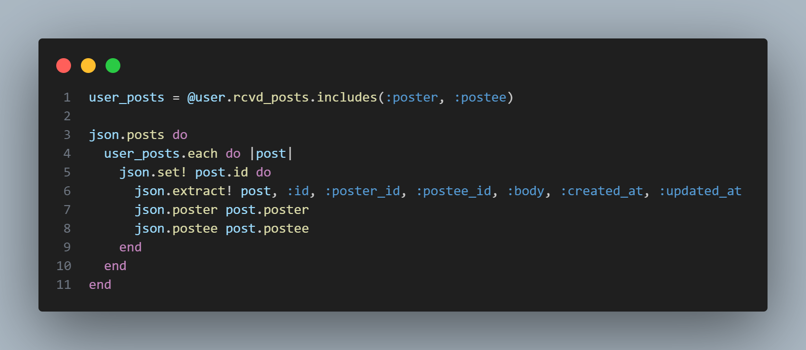
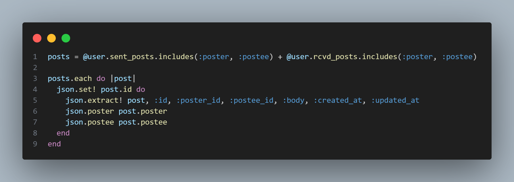
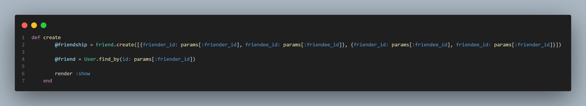
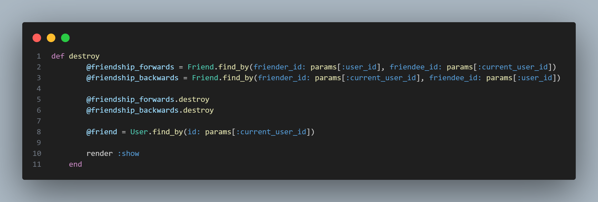
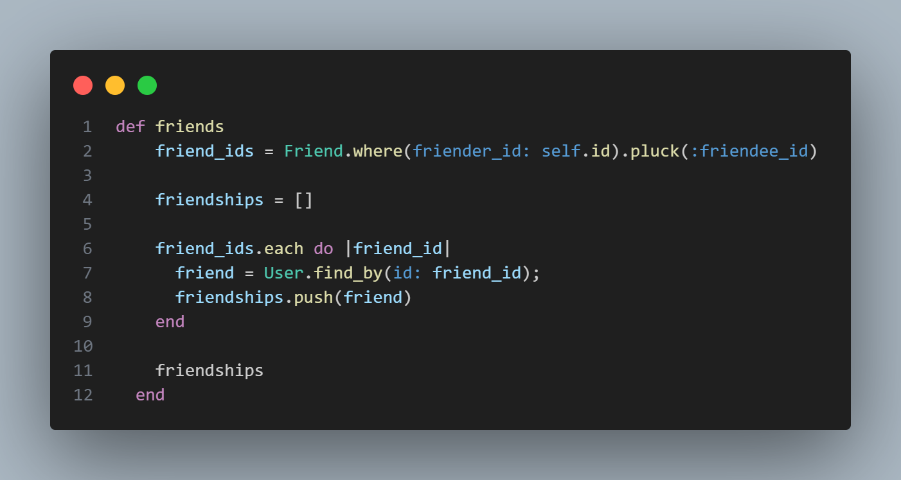

<h1>Facebook Production README</h1>

[Live Site](https://facebook-app-bwzo.onrender.com)

<h2>App Description</h2>

Facebook is a social networking website where users connect with friends.

If one user knows another, they can "friend" one another and each will appear in the respective friends lists' of one another.  Users also have the ability to "unfriend" users they are friends with.

Users can create a profile including a profile page where other users can post on the "wall" of their profile page.  Posters of wall posts can also edit and delete posts.

Finally, there is a News Feed page that displays all of the wall posts, both send and received of the currently logged in user.

<h2>Technologies Utilized</h2>

1. React
2. Redux
3. Rails
4. AWS

<h2>Noteworthy Features</h2>

<h3>Wall Posts</h3>

Wall Posts are a full CRUD feature where you can create, read, update and delete a wall post.

The Wall Posts feature allows a user's friends to post comments on their wall and as mentioned above is full CRUD.  Being the first time using the Rails/React stack, one of the challenges I faced was minimizing the amount of queries to the backend while keeping the frontend state clean.  In order to do this, once you got to a User's Show Page, all the information to be displayed on that User's Show Page is grabbed from the PostgreSQL server.  Below is a code snipping of the React App grabbing the received wall posts from the backend.

The above fetch did not work when I was displaying the News Feed since I also needed sent posts.  In order to overcome this, I created a Posts Index json.jbuilder in order to fetch both sent and received posts which using the reduced would start with a fresh slice of state.  Below is a code snipping of the Post's Index json.jbuilder

<h3>Friending</h3>

Perhpas one of the biggest challenges faced was creating the friends table on the backend.  Since it didn't matter who in the realtionship was the friender - the person who initiated the friendship - and the friendee - the person who received the friendship request, I needed to create table entries both "forwards" and "backwards" when a friendship was created in the controller - see below code snippet.

This meant that when a friendship was deleted, which happens when one user "unfriends" another, not one but both of those entries needed to be deleted.  Please see the below snipping of the delete action in the friends controller.

Finally, as mentioned above, in order minimize the amount of requests to the backend, I needed a custom query in order to find all of the friends of the User whose show page was being displayed.  To accomplish this, I created said custom query in the Users model which would find all of the friends associated with the User Id from the params of the User being displayed on the page.  Please see the below code snippet of that custom query using active record.

